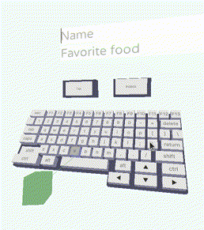

# lovr-letters
A [lovr.org](https://lovr.org) extension library that adds virtual keyboards for text input in VR.

## Available keyboards

### `TapKeyboard`

A regular QWERTY keyboard that floats in front of the user, where you can use a ray+trigger button
to tap keys.



### `IndeckKeyboard`

A TapKeyboard subclass made for programming with InDeck.


## Usage

`letters` needs to be initialized from load(). Then you can let `letters` show keyboards
for you when needed, or manually create and display it/them when you want one.
The `letters` module needs to be `update()`d each frame, and the keyboard(s) you are using
needs to be `update()`d and `draw()`n as well.

Use this to have `letters` automatically show a keyboard when a text field
needs it:

```
local letters = require('letters')
function lovr.load()
  letters.load()
  letters.defaultKeyboard = letters.Keyboards.Tap
end

function lovr.update()
  letters.update()
end

function lovr.draw()
  letters.draw()
end
```

Use this to manage your keyboard manually:

```
local letters = require('letters')
function lovr.load()
  letters.load()
  myKeyboard = letters.Keyboards.Tap:new{world=letters.world}
end

function lovr.update()
  letters.update()
  myKeyboard:update()
end

function lovr.draw()
  myKeyboard:draw()
end
```

The keyboard events are delivered as if it was a physical keyboard. Use the keyboard
events to read input:

```
function lovr.load()
  lovr.handlers["keypressed"] = function(code, scancode, repetition)
    print(code)
  end
end
```
